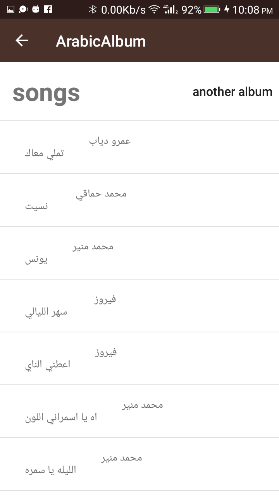
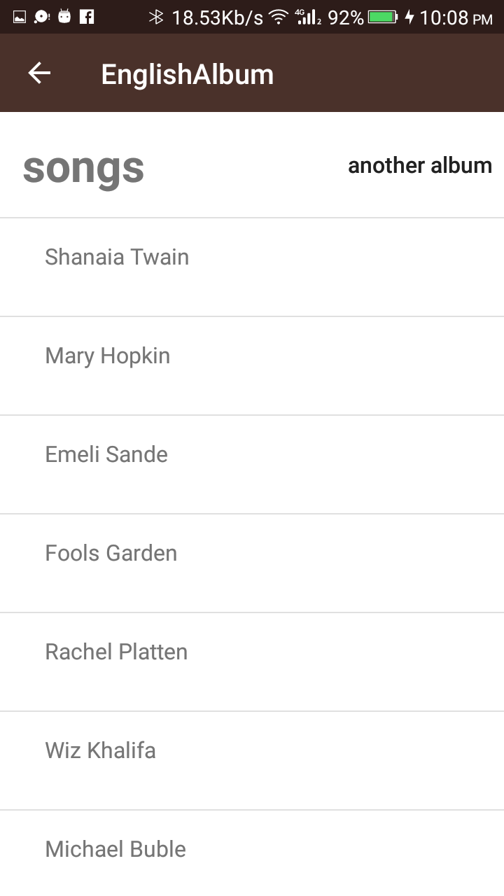
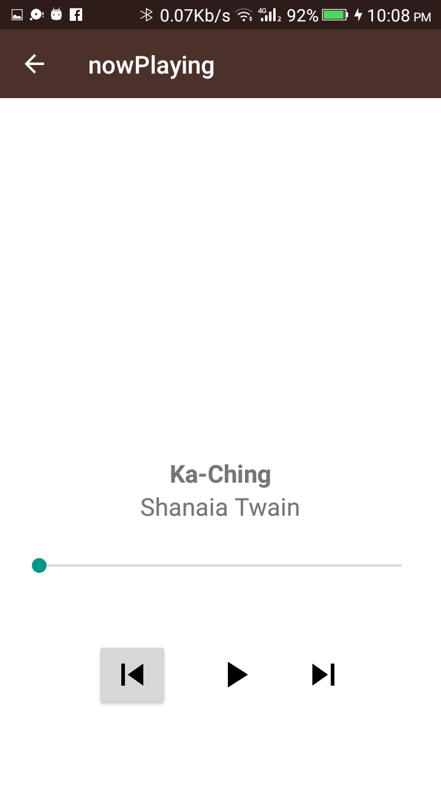

# Music-player-App
music app using Intents, New Activities, Arraylists, Loops and Custom Classes.
The goal is to design and layout the flow for the structure of a Music Player app.
## Built With
UI Design, GridView, ArrayAdapter.
## requirements
Select a potential structure and create an app with that structure in Android Studio.
App should have 3 to 6 Activities.
The app’s structure is suitable for a music player app.
Each activity contains a TextView which explains the purpose of the activity.
Each button’s behavior is determined by an OnClickListener in the Java code rather than by the android:onClick attribute in the XML Layout.
Each button properly opens the intended activity using an explicit Intent.
Code is properly-formatted, readable and runs error-free.
## Ideas and Skills
    Designing an app experience to achieve a certain goal.
    Creating new activities.
    Using explicit Intents to link between activities in your app.
    Using OnClickListeners to add behavior to buttons using Java code.
    Creating your own Custom Class.
    Looping through an ArrayList.
    Populating a ListView or GridView with an ArrayAdapter.

## Screenshot

